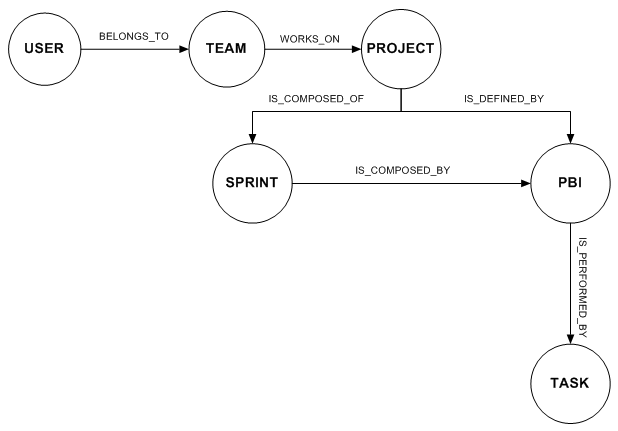

# ScrumGraph 

Este proyecto corresponde al backend de la aplicación web construida como proyecto de grado.

**SCRUMGRAPH** es un prototipo de aplicación web que facilita el seguimiento de las iteraciones y las tareas planificadas en un proyecto de software que aplique el marco de trabajo ágil Scrum, utiliza la visualización de datos para comunicar la información del proyecto de una manera sencilla, clara y eficiente a los usuarios, mediante su codificación y representación como objetos visuales contenidos en gráficos. SCRUMGRAPH utiliza un grafo que representa los componentes de un proyecto Scrum, que a través de colores, formas y gráficos ayuda a los usuarios a entender el significado de los datos de sus iteraciones y tareas ya que los coloca en un contexto visual que les permite: reconocer las relaciones entre los datos e identificar de una manera sencilla y rápida cual es el estado de las tareas, de las iteraciones y del mismo proyecto en general y contar con indicadores numéricos y estadísticas que apoyen el seguimiento y la toma de decisiones en la ejecución de proyectos Scrum y en la planeación de proyectos futuros.


## Tecnologias
* Servicios RESTful construidos con jersey.
* Neo4j - BDOG (Graph Database)


## Modelo 




## Servicios REST


El proyecto cuenta con los siguientes RESTful services:


### Crear Usuario

POST
````
	http://host:port/ScrumGraph/sgrest/users
````


### Request

*Content-Type:* application/json

*X-ScrumGraph-Header:*

{"authToken": "b24212354022337c4040c8"}

*Entity Body:*

{
    "name": "Cristian",
    "lastName": "Peña",
    "email": "cristiancamilopena@gmail.com",
    "password": "asassaddsd",
    "roleDefault": "team-member",
    "isAdmin": false
}

### Response

{
    "status": "ok",
    "errorMsg": "",
    "errorCode": 0,
    "response": {
        "user": {
            "id": 3,
            "name": "Cristian",
            "lastName": "Peña",
            "email": "cristiancamilopena@gmail.com",
            "roleDefault": "team-member",
            "available": "true",
            "isAdmin": "false",
            "authToken": "eea30a4cec3e24441302331"
        }
    }
}