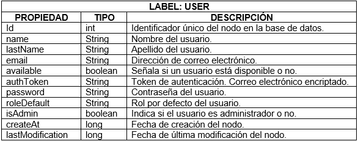
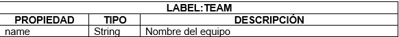
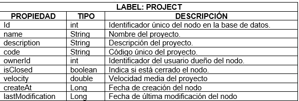
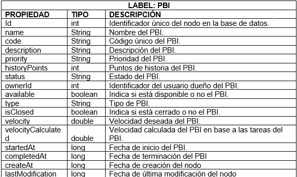
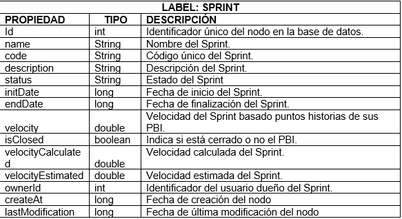
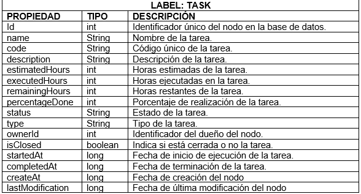

## Table of Contents
+ **[ScrumGraph](#scrumgraph)**<br>
+ **[Branch Info](#branch-info)**
+ **[Modelo](#modelo)**
> + **[Elementos del modelo](#elementos-del-modelo)**
+ **[Constraints](#constraints)**
+ **[RESTful services](#restful-services)**

# ScrumGraph 

Este proyecto corresponde al backend de la aplicación web construida como proyecto de grado.

**SCRUMGRAPH** publica una serie de recursos de RESTful web services relacionados con los elementos claves en el framework de Scrum,  con el objetivo de almacenar dichos elementos en grafos para dar un apoyo en la toma de decisiones en los compromisos a adquirir en la planificación de futuros Sprints, basandose en la información registrada en cada Nodo.

## Branch Info

### TAG 0.0.1
   * Servicios RESTful construidos con jersey.
   * Neo4j - (Graph Database)
   * Java 7

### Branch 1.0.X
  * Spring Boot 1.5.9.RELEASE
  * Spring Framework 4.3
  * Spring REST
  * Spring AOP
  * Spring DATA - Neo4j [2.2.3]
  * Java 8

### Branch 2.0.X
  * Spring Boot
  * Spring Framework 5
  * Spring REST
  * Spring DATA - Mongo DB
  * Java 8-9

## Modelo 

La ejecución de proyectos de desarrollo de software basados en el marco de trabajo SCRUM requiere de la realización de un control y/o seguimiento.  La base de datos que se plantea para este contexto se centra en la información relacionada a los elementos más relevantes de SCRUM que intervienen en el proceso de la construcción de incrementos funcionales de un producto software.  Estos elementos son: Usuarios, Proyectos, Sprints, Product Backlog Items (PBI) y Tareas.

Un usuario pertenece a un equipo de SCRUM, el equipo trabaja sobre un proyecto. Un proyecto está compuesto por Sprints y a su vez está definido por los Product Back Log Items. Un Sprint trabaja sobre una serie de PBI’s.  Un PBI se realiza mediante un conjunto de tareas.

El esquema del modelo de la base de datos en grafo del dominio de la aplicación es el mostrado en la siguiente imagen:


### Elementos del modelo

#### Nodos

* USER => Representa los usuarios o miembros pertenecientes a un equipo de SCRUM.
* TEAM => Representa el equipo de SCRUM
* PROJECT => Representa el proyecto de software sobre el qué se va a realizar el seguimiento.
* PBI => Representa a los Product Backlog Items que componen las funcionalidades a realizar en un proyecto. 
* SPRINT => Representa las iteraciones realizadas sobre un proyecto.
* TASK => Representa las tareas realizadas en un PBI.

#### Relaciones

- BELONGS_TO => Relación entre los nodos USER y TEAM,  indica que usuarios de la aplicación pertenecen a un equipo de SCRUM.
- WORKS_ON => Relación entre los nodos TEAM y PROJECT,  indica el equipo responsable de un proyecto.
- IS_DEFINED_BY => Relación entre los nodos PROJECT y PBI, indica las funcionalidades (PBI) con las qué está compuesta un proyecto de software.
- IS_COMPOSED_OF => Relación entre los nodos PROJECT y SPRINT, indica las iteraciones  necesarias para la realización del proyecto de software.
- IS_COMPOSED_BY => Relación entre los nodos SPRINT y PBI, indica cuales funcionalidades se trabajan sobre una iteración del proyecto de software. 
- IS_PERFORMED_BY => Relación entre los nodos PBI y TASK, indica las tareas necesarias para realizar una funcionalidad.

#### Atributos

Los atributos son las propiedades clave-valor establecidas en cada nodo del modelo de la base de datos orientada a grafos.
A continuación se exponen los atributos definidos para cada uno de los nodos.

  
  


  
  


  
  


  
  


  
  


  
  
  

#### Constraints

Los constraints nos permiten tener valores únicos sobre las propiedades de los nodos con la misma especificación de label. 

Se definieron los siguientes constraints:

- Nodo USER: Se define constraint sobre la propiedad email.
- Nodo PROJECT: Se define constraint sobre la propiedad code.
- Nodo PBI: Se define constraint sobre la propiedad code.
- Nodo SPRINT: Se define constraint sobre la propiedad code.
- Nodo TASK: Se define constraint sobre la propiedad code.

## RESTful services

**[En Construcción]**
El proyecto cuenta con los siguientes RESTful services:

## ScrumGraph Services
+ **[User's Request](#user-request)**<br>
   >  **[Create](#create-an-user)**
   >  **[Find All](#get-all-users)**


## User Request

#### Create an user

###### **Request Info**

  + **Http Method:** POST
  + **URI:**  ````http://host:port/ScrumGraph/sgrest/users````
  + **Content-Type:** application/json
  + **Headers:**  *X-ScrumGraph-Header:* {"authToken": "*token_autogenerated*"}
  + **Entity Body:**
  ```json
      {
      "name": "Cristian",
      "lastName": "Peña",
      "email": "cristiancamilopena@gmail.com",
      "password": "asassaddsd",
      "roleDefault": "team-member",
      "isAdmin": false
      }
  ```

###### Response Info

  + **Entity Body:**
  ```json
      {
          "status": "ok",
          "errorMsg": "",
          "errorCode": 0,
          "response": {
              "user": {
                  "id": 3,
                  "name": "Cristian",
                  "lastName": "Peña",
                  "email": "cristiancamilopena@gmail.com",
                  "roleDefault": "team-member",
                  "available": "true",
                  "isAdmin": "false",
                  "authToken": "eea30a4cec3e24441302331"
              }
          }
      }
  ```

#### Get All Users

###### **Request Info**

+ **Http Method:** GET
+ **URI:**  ````http://host:port/scrumgraph/sgrest/users````
+ **Content-Type:** application/json
+ **Headers:**  *X-ScrumGraph-Header:* {"authToken": "*token_autogenerated*"}

###### Response

+ **Entity Body:**
```json
{
    "status": "OK",
    "errorMsg": "",
    "code": 200,
    "response": {
        "users": [
            {
                "id": 1,
                "name": "SUPER ADMIN SG",
                "lastName": "SCRUM GRAPH",
                "email": "superadminsg@gmail.com",
                "available": true,
                "admin": true
            },
            {
                "id": 2,
                "name": "Jimena",
                "lastName": "Rodríguez",
                "email": "jimenarp@gmail.com",
                "available": true,
                "admin": false
            },
            {
                "id": 3,
                "name": "Cristian",
                "lastName": "Peña",
                "email": "cristiancamilopena@gmail.com",
                "available": true,
                "admin": false
            }
        ]
    }
}
```


**Pendiente de generar la documentación de los servicios**